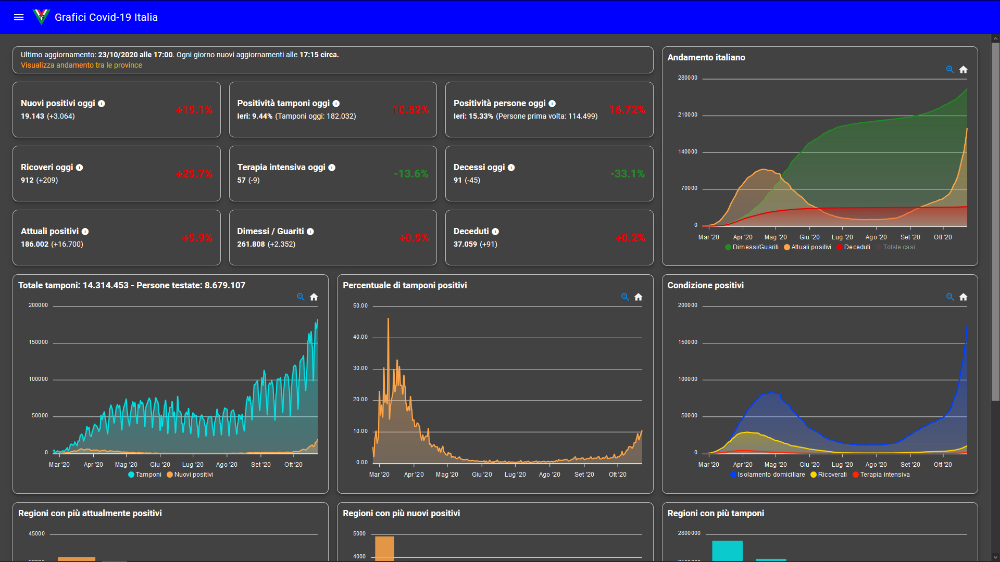

# Covid-19 Charts for Italy

Covid-19 trend dashboard in Italy.
Daily swabs trend, new positives and many other data to monitor the epidemiological situation in Italy.

Dashboard link: [italia-covid19.web.app](https://italia-covid19.web.app)<br>
Where does all the data come from? [github.com/pcm-dpc/COVID-19](https://github.com/pcm-dpc/COVID-19)

## Example


## Project setup
```
npm install
```

### Compiles and hot-reloads for development
```
npm run serve
```

### Compiles and minifies for production
```
npm run build
```
